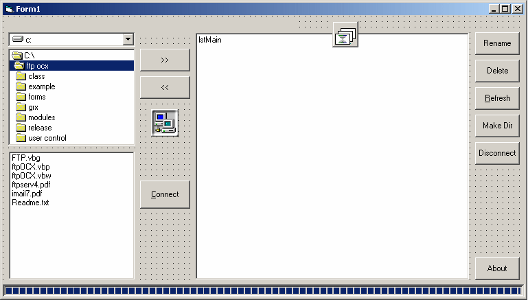



## FTP Control

### Description

This is an FTP OCX control. What it does is provide easy to use FTP access to applications. Applications can choose weather to download the file to a location using this control or to strictly store it in a string and make it accessible to the application. This way you could use it to say download a text file from an FTP site in your text editor. I know this control will work in vb6, and I'm almost positive it will also work in VB 4 and 5 because it just uses API to achieve it's goal. Leave comments and suggestions. Thanks :)
 
### More Info
 

             |
---                |---
**Submitted On**   |2001-09-13 17:14:24
**By**             |[Stewart](https://github.com/Planet-Source-Code/PSCIndex/blob/master/ByAuthor/stewart.md)
**Level**          |Intermediate
**User Rating**    |5.0 (20 globes from 4 users)
**Compatibility**  |VB 4\.0 \(32\-bit\), VB 5\.0, VB 6\.0
**Category**       |[Custom Controls/ Forms/  Menus](https://github.com/Planet-Source-Code/PSCIndex/blob/master/ByCategory/custom-controls-forms-menus__1-4.md)
**World**          |[Visual Basic](https://github.com/Planet-Source-Code/PSCIndex/blob/master/ByWorld/visual-basic.md)
**Archive File**   |[FTP\_Contro18120110302004\.zip](https://github.com/Planet-Source-Code/stewart-ftp-control__1-56998/archive/master.zip)

